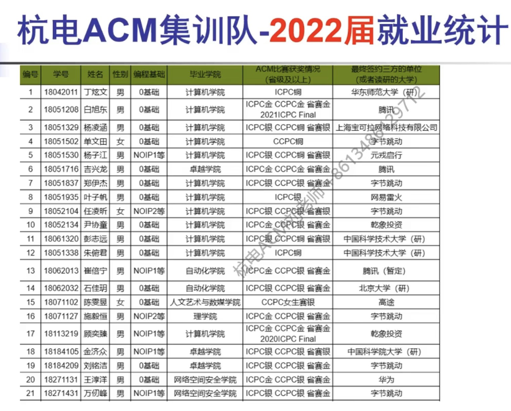

# **第一课-基础知识**

## **自我介绍**


<br/>

## **蓝桥杯/ACM介绍**

比赛形式、内容；

比赛例子；

蓝桥杯和ACM的关系；





<br/>

## **AI工具讲解**

对话交互式AI，例如：

-   [豆包](https://www.doubao.com/chat/)、[文心一言](https://yiyan.baidu.com/)、[ChatGPT](https://chat.tinycms.xyz:3002/)等：

AI陪练：

-   https://www.marscode.cn/home


<br/>

## **需要哪些基础？**

需要：

-   一门主流的编程语言：
    -   C++、Java（推荐）
    -   Python
-   基本的数学知识；
-   数据结构相关知识；


<br/>

## **如何准备？**

B站学习视频：

-   杭电：https://www.bilibili.com/video/BV1CU421Z7SZ/
-   北理工：https://www.bilibili.com/video/BV1pE411E7RV/
-   算法：https://space.bilibili.com/206214
-   其他：https://search.bilibili.com/all?vt=25105471&keyword=acm%E5%9F%B9%E8%AE%AD&order=click&duration=4

<br/>

其他学习资源：

-   总：[oi-wiki.org](https://oi-wiki.org/)
-   C++：https://github.com/pzxy-cs/acm-challenge-workbook
-   python：https://github.com/pzxy-cs/ACM-ICPC-Preparation
-   go：https://github.com/EndlessCheng/codeforces-go

<br/>

OJ平台：

-   蓝桥杯官方：https://www.lanqiao.cn/problems/?first_category_id=1&second_category_id=6
-   C语言网：https://www.dotcpp.com/oj/problemset.php?page=1
-   AcWing：https://www.acwing.com/problem/
-   洛谷：https://www.luogu.com.cn/problem/list
-   ACM OJ汇总：https://vjudge.net/
    -   杭电：https://acm.hdu.edu.cn/
    -   北大：http://poj.org/
    -   浙大：https://pintia.cn/problem-sets/91827364500/exam/problems/type/7
    -   CodeForces：https://codeforces.com/
-   找工作、求职：
    -   https://leetcode.cn/
    -   https://www.nowcoder.com/exam/oj


<br/>

## **如何编写代码**

### 工具

推荐：Jetbrains 开发工具；

如：

-   Java：IDEA
-   Python：PyCharm
-   C++：Clion

也可以使用 VSCode 配合插件；

<br/>

### 如何写好代码

思路？模块化？


<br/>

## **基本输入输出讲解**

Java 基本输入输出：

1、使用`Scanner`类：

```java
   import java.util.Scanner;

   public class Main {
       public static void main(String[] args) {
           Scanner scanner = new Scanner(System.in);
           int num = scanner.nextInt();
           String str = scanner.next();
           // 其他数据类型也类似，如 scanner.nextDouble()、scanner.nextLong() 等
       }
   }
```

这种方式比较灵活，可以读取不同类型的数据。

<br/>

2、从命令行参数获取输入：

```java
   public class Main {
       public static void main(String[] args) {
           // args 数组中存储了命令行传入的参数
           if (args.length > 0) {
               int num = Integer.parseInt(args[0]);
               // 处理输入参数
           }
       }
   }
```

在运行程序时可以从命令行传入参数，这种方式在一些特定场景下比较有用。

<br/>

3、对于特定格式的输入，可以使用`BufferedReader`结合`InputStreamReader`来读取：

```java
   import java.io.BufferedReader;
   import java.io.IOException;
   import java.io.InputStreamReader;

   public class Main {
       public static void main(String[] args) throws IOException {
           BufferedReader reader = new BufferedReader(new InputStreamReader(System.in));
           String line = reader.readLine();
           int num = Integer.parseInt(line);
           // 处理输入
       }
   }
```

这种方式在处理多行输入或者复杂格式的输入时可能更加方便。

<br/>

## **具体竞赛例子**

以 `“萌新首秀”全国高校新生编程排位赛3` 为例：

-   https://www.lanqiao.cn/contests/24xspws-3/challenges/


